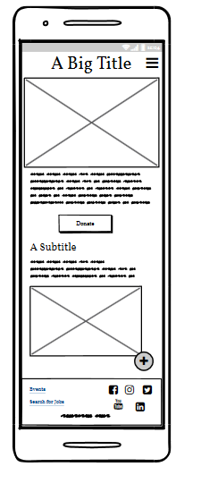
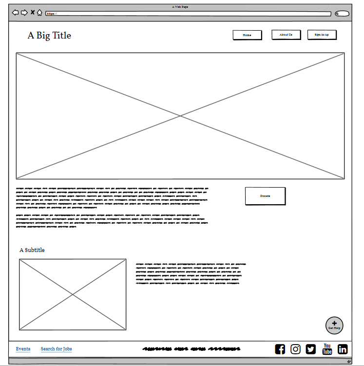
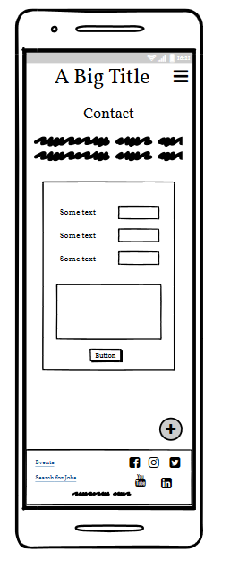
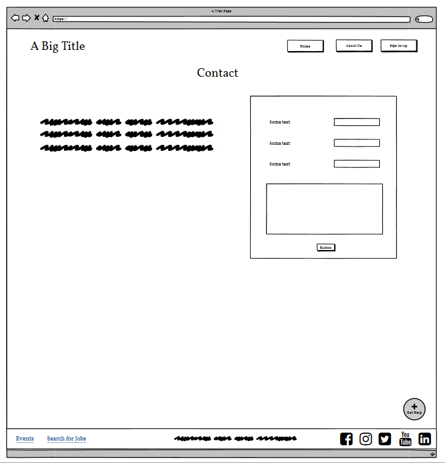
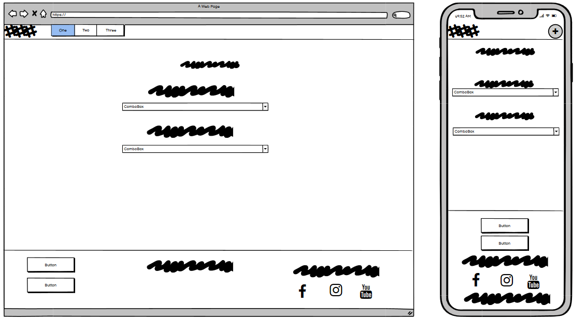
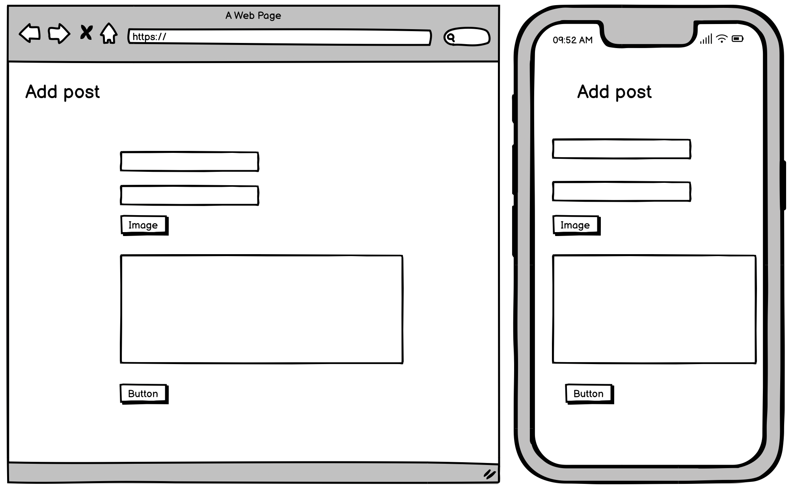
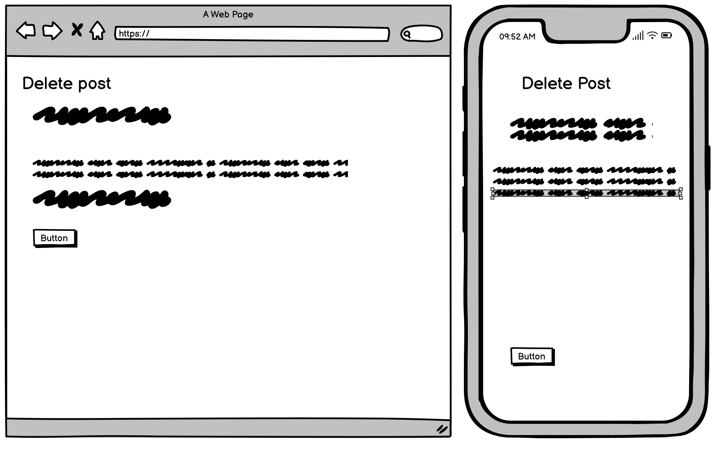
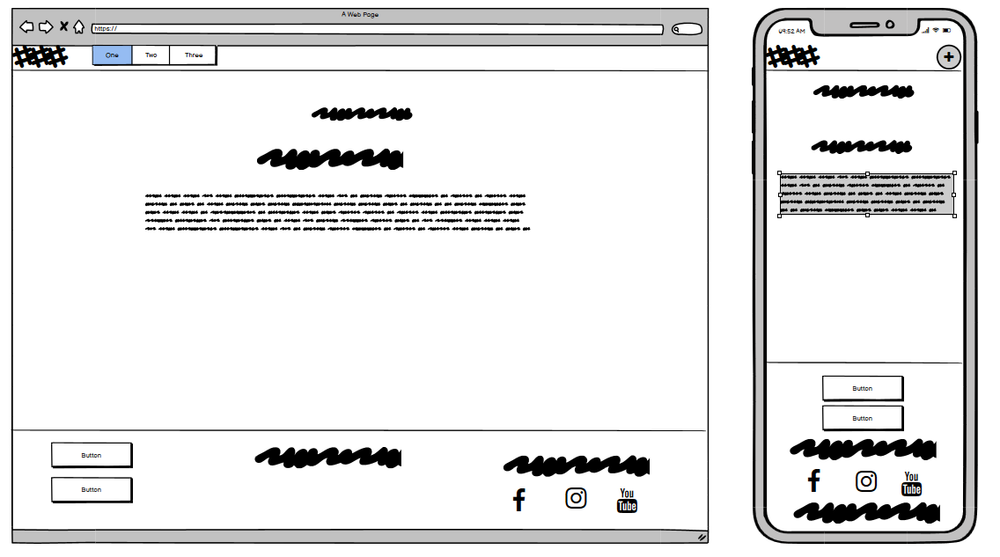
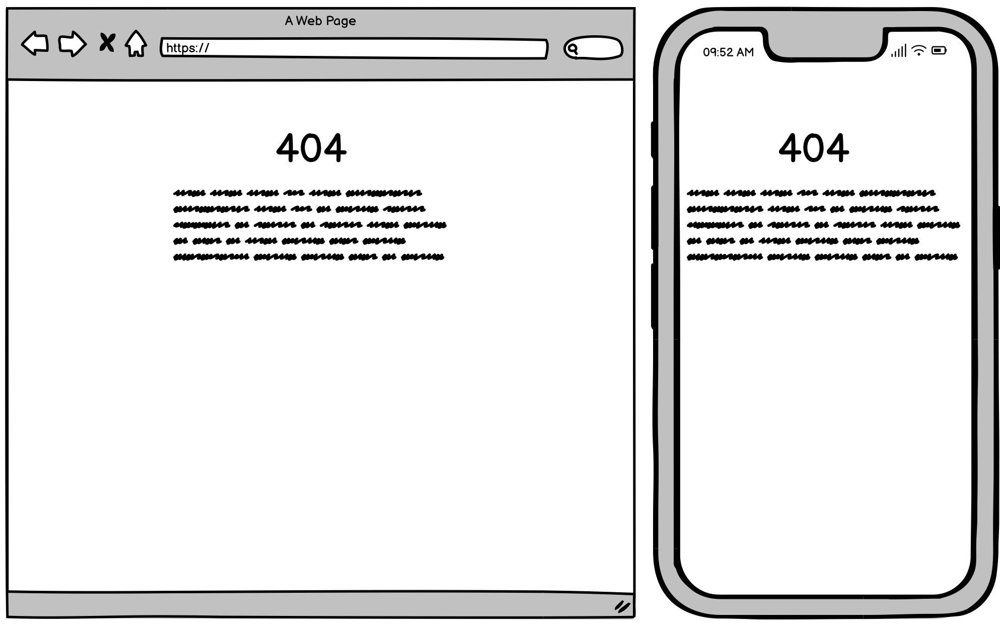
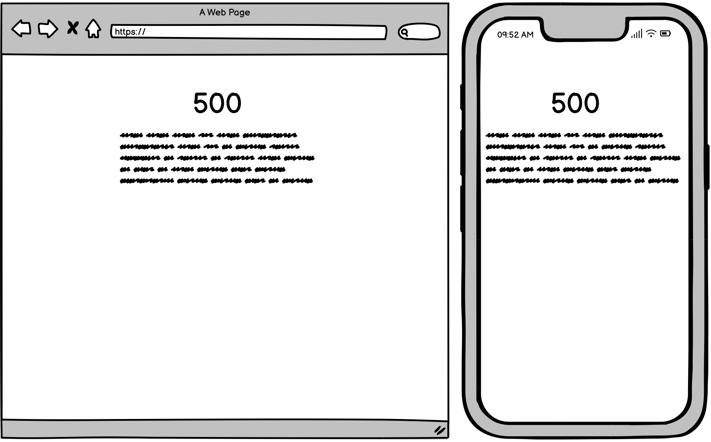

# CheckPoint

CheckPoint is a website that has been created to facilitate a peer-led support service to veterans dealing with mental health struggles. The blog style of the site allows veterans to share their own experiences and explore different ways of improving their health & wellbeing.

[Visit the  live website here]()

 

## Contents
----

### [User Experience (UX)](#user-experience-ux-1)
- [Purpose](#purpose)
- [User Stories](#user-stories)
  - [First Time Visitors](#first-time-visitor-goals)
  - [Returning Visitors](#returning-visitor-goals)
  - [Frequent Users](#frequent-visitor-goals)

### [Design](#design-1)
- [Colour Scheme](#colour-scheme)
- [Typography](#typography)
- [Imagery](#imagery)
- [Wireframes](#wireframes)

### [Features](#features-1)
- [Existing Features](#existing-features)
  - [Homepage](#homepage)
  - [About Us page](#about_us_page)
  - [Blog page](#blog_page)
  - [Contact page](#contact_page)
- [Accessibility](#accessibility)
- [Future Features](#future-features)

### [Technologies](#technologies-1)

### [Version Control](#version-control-1)

### [Deployment](#deployment-1)

### [Testing](#testing-1)
- [Function Testing](#function-testing)
- [User Story Testing](#user-story-testing)
- [Lighthouse](#lighthouse)
- [Validator Testing](#validator-testing)
- [Bugs](#bugs)

### [Credits](#credits-1)
- [Resources](#resources)
- [Acknowledgements](#acknowledgements)

 

----

 

## User Experience (UX)
### **Purpose**

CheckPoint's mission is to facilitate a peer-led support service to ex-servicemen and women who are struggling with mental health. The blog style of the site allows veterans to share their own experience and explore different ways of improving their health and well-being. The driving force behind this method of digital story sharing is to enable users to discuss their difficulties transitioning back to civilian life without the attached mental health stigma.

We hope that through the medium of blogging, veterans are able to share their experiences and explore different ways of improving their quality of life in a safe, unassuming environment.

Checkpoint allows the user to write their story and/or digitally upload their art. They can do this by taking a picture of their work and uploading it and/or write a blog post.

 

### User Stories
### **Client Goals**
- To inform users how they can get mental health support
- To provide a clear and simple way for users to share their story
- To connect users with each other
- To be able to view on a range of devices
- To create a non-judgemental and inclusive brand identity

 

### **First Time Visitor Goals** 
- I want to be able to easily find the number to contact a helpline
- I want to be able to easily create an account
- I want to be able to read other posts by members
- I want to be able to comment on and like other posts
- I want to be able to create a blog post

 

### **Returning Visitor Goals**
- I want to be able to login easily
- I want to be able to edit my blog posts
- I want to be able to post on the blog anonymously

 

### **Frequent Visitor Goals**
- I want to be able to upload images to my blog posts
- I want to be able to access further support resources

 

----

## Design
### **Colour Scheme**
The chosen colour scheme has been based on the colours of the British flag. These colours should resonate strongly with ex-servicemen and women.

 

### **Typography**

 

### **Imagery**
Logo: The logo has been created using [Canva](canva.com). The simple and inelaborate design features the colours of the British flag in line with the colour scheme throughout the site.

 

We want the UX of this site to reflect a strong message of inclusivity, and imagery has been chosen to reflect this.

Images have been sourced from [Pexels](https://www.pexels.com/) and [Adobe Stock](https://adobe.ly/3GJB37o).

 

### **Wireframes**
[Balsamiq Wireframing Software](https://balsamiq.com/) was used to create the wireframes.

Homepage (mobile)

Homepage (desktop)

 

About Us (mobile)

About Us (desktop)

 

Contact (mobile)

Contact (desktop)

 

Blog Pages

Sign Up:

Login:

Profile:

Add Post:

Delete Post:

Logout:

 

Error Pages

 

Blog Pages

Sign Up:

Login:

Profile:

Add Post:

Delete Post:

Logout:

 

Error Pages

 

----

## Features
### **Existing Features**

**All** pages include the following features:
- Navigation bar:

- Footer: The footer contains the icons for social media and these are linked to the Ex-Military Careers sites. As this site has been produced in association with Ex-Military Careers links to their webpages and social media sites are used throughout.
- Footer:

- Get help button:

 

### Homepage

 

### About Us page

 

### Contact page

 

### **Accessibility**
In addition to being best practice, having an accessible website is extremely high on the list of requirements for the target audience. Close attention has been paid to the following in order to ensure the site is as accessible as possible:
- Clear and simple font styling, avoiding any cursive or calligraphic scripts.
- Contrasting colour scheme, but avoiding colours that are too bold.
- Use of semantic HTML
- Ensuring all images have an alt description for screen readers or where the image cannot be loaded. Also ensuring that these are as descriptive as possible.

 

### **Future Features**
In the future there are features and developments that it would be useful to consider adding to create an even better user experience of this website. They include:
- Developing the art therapy section of the site to be seperate from the stories blog
-

 

----

## Technologies
### **Languages Used**
This website has been written in...

 

**Frameworks, Libraries and Programs Used**
- 

 

----

## Version Control
Version control has been maintained using Git. The code written for this website has been updated via regular commits to Github. These serve as a record of development and changes made.

The commit history can be viewed [here]()

 

----

## Deployment

 

----

## Testing
Testing was performed across a range of devices, including:
- 

### **Function Testing**

| Page | Test | Successfully Completed |
| :----| :---| :----------------------:|
|  |  |  |
|  |  |  |
|  |  |  |
|  |  |  |
|  |  |  |
|  |  |  |
|  |  |  |

 

### **User Story Testing**

| Client Goal | Solution | Tested & Successfully Completed |
| :----| :---| :----------------------:|
|   |  |  |
|   |  |  |
|   |  |  |
|   |  |  |
|   |  |  |

 

| First Time Visitor Goal | Solution | Tested & Successfully Completed |
| :----| :---| :----------------------:|
|   |  |  |
|   |  |  |
|   |  |  |
|   |  |  |

 

| Returning Visitor Goal | Solution | Tested & Successfully Completed |
| :----| :---| :----------------------:|
|  |  |  |
|  |  |  |
|  |  |  |

 

| Frequent Visitor Goal | Solution | Tested & Successfully Completed |
| :----| :---| :----------------------:|
|  |  |  |
|  |  |  |
|  |  |  |

 

### **Lighthouse**

For Mobile Devices

Homepage

About Us Page

Contact Page

 

For Desktop

Homepage

About Us Page

Contact Page

 

### **Validator Testing**
HTML

Homepage

About Us Page

Contact Page

 

CSS

Stylesheet

   

### **Bugs**
  
  | Raised by | Bug | Solution |
  | :---      | :---| :---     |
  |  |  |  |
  |  |  |  |
  |  |  |  |
  |  |  |  |
  |  |  |  |
  |  |  |  |

 

----

## Credits
### **Resources**
- 

 

### **Acknowledgements**
